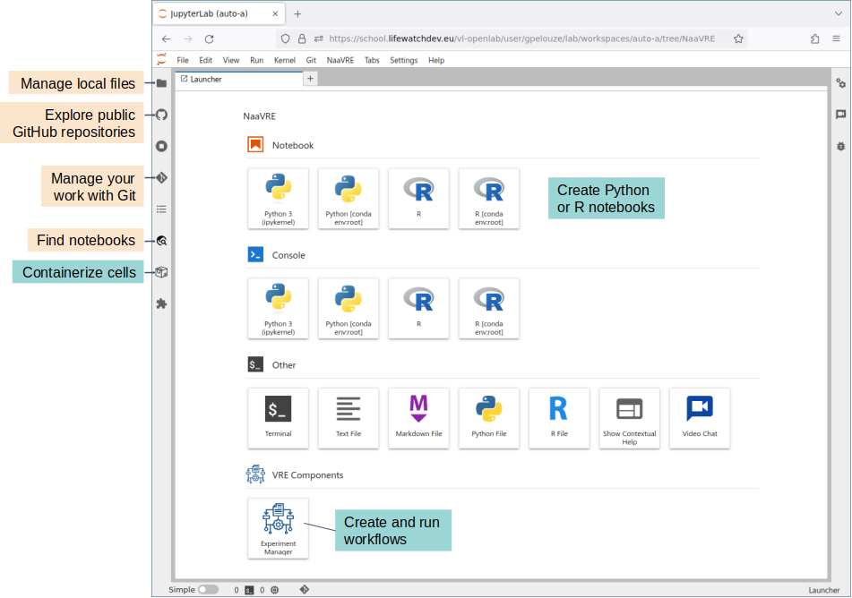
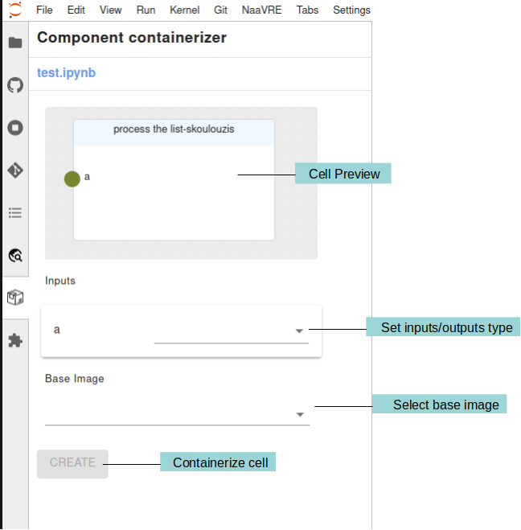
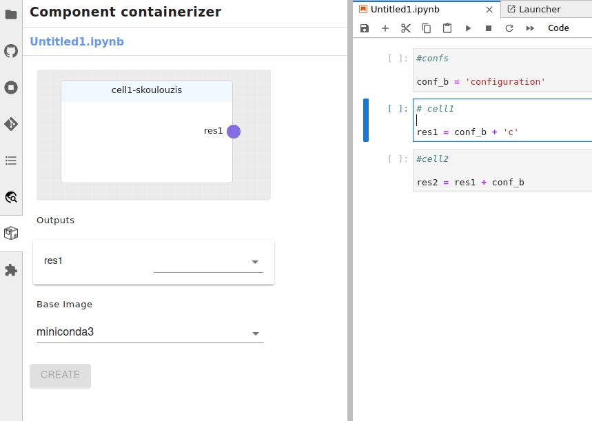
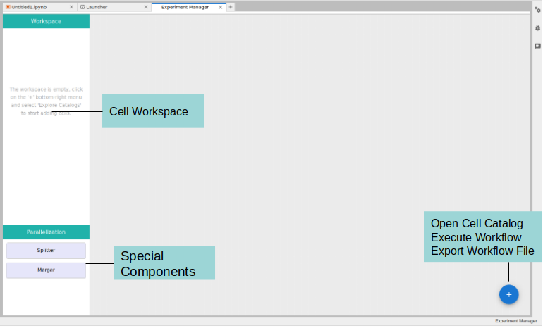
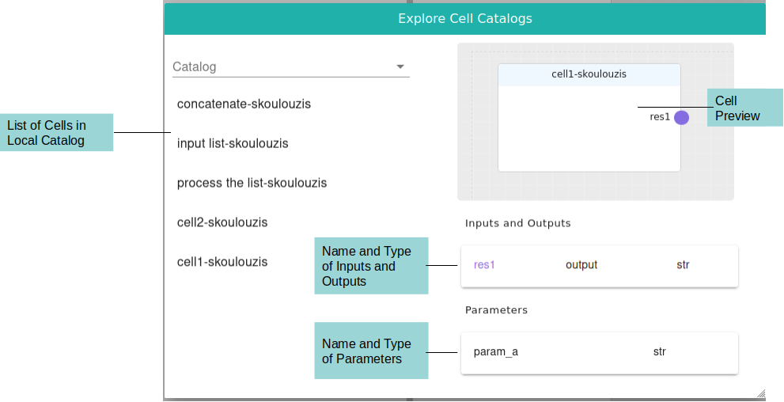
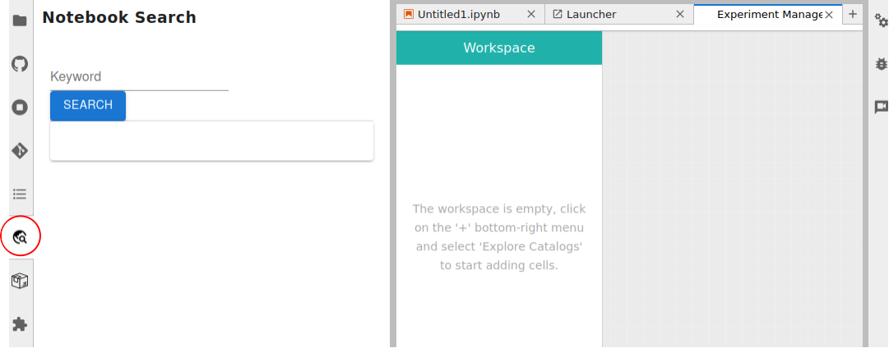
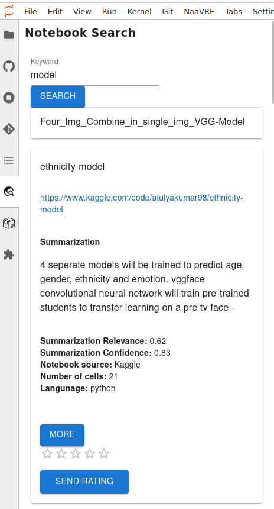
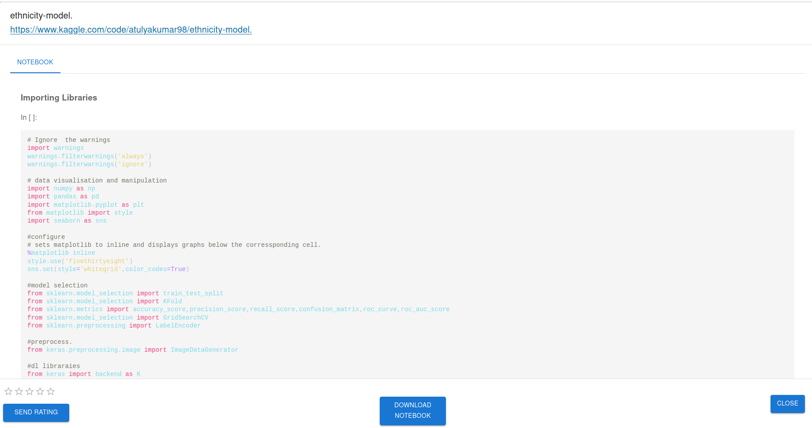

# The NaaVRE Interface

The Notebook as a Virtual Research Environment (NaaVRE) is a set of tools to allow users to containerize cells, compose
workflows and execute them on a workflow engine.

## Component Containerizer

The 'Cell Preview' panel shows a preview of the cell that is currently selected including its name, inputs and outputs.
Under the 'Cell Preview' panel there a list of the inputs and outputs of the cell and their types. The types are needed
to be filled in by the user when containerizing a cell. Currently, the supported types are:
* String
* Integer
* Float
* List

Under the 'Inputs' and 'Outputs' there is the 'Base Image' selection. This is the base image that will be used to build
the container. The default base image is 'miniconda3'. The user can select a different base image from the drop down.

### Special Variables

The user can use two special variables in the cell code:
* `param_`: This variable is used to pass input parameters to the cell. These parameters are passed to the cell during
  execution and are requested by the user every time a workflow is executed that contains the cell with the parameters.
[Param_example.webm](https://github.com/QCDIS/vre_documetation/assets/9680609/fea3d96b-97d3-43cd-b009-b5bd4537de5a)

* `conf_`: This variable is used to pass configuration parameters to all cells. `conf_` variables once deca-lied are visible
 by all cells of the workflow. They can be thought of as 'global' variables therefore, they do not require to set their type
 like other variables.
[Conf_example.webm](https://github.com/QCDIS/vre_documetation/assets/9680609/f7020f7f-69d9-4916-bb56-83ed64cb98a8)

Notice in the image above that the `conf_b` variable is declared in the first cell and used in the second and third cell.
However, the `conf_b` is not showing up as input in the second and third cell.

## Experiment Manager

In the 'Experiment Manager' page you can compose and execute workflows. To compose a workflow click on the '+' button in
the bottom right corner of the page and select the 'Cells Catalog' option.

After you have selected the cells you want to compose a workflow with, click on the 'Add to Workspace' button.

### Special Components

In the 'Experiment Manager' page you can compose workflows using special components. These components are:
* Splitter: This component is used to split an output array from a call into its elements and feed each element to the
  next cell. That way the next cell will be executed in parallel as many times as the number of elements in the array.
* Merger: This component is used to merge the outputs of multiple cells into a single array.

### Cells Catalog
The cells catalog contains all the cells that have been containerized.

## Notebook Search

In the 'Notebook Search' page you can search for notebooks relevant to your research. To search for notebooks click on
the icon in the middle left of the page. There you can search for notebooks.

The results will be displayed in the left panel. If you clik on a result you will be shown some relevant information
such its title, link, summary etc. If you click on the 'More' button you will be redirected to the notebook where you
can download it.

## Jupyterlab-git

In all VLs there is a Git integration with jupyterlab-git.
To clone and push to a repository you can follow the instructions from here: [jupyterlab-git](https://pypi.org/project/jupyterlab-git/).
