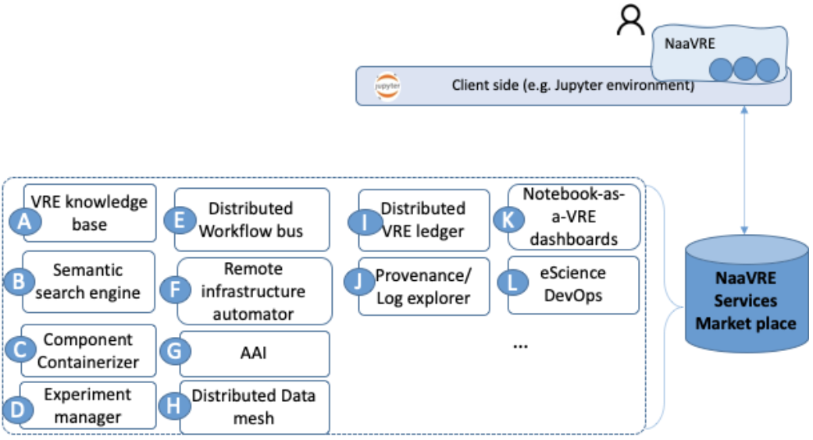

# Virtual Research Environments

Virtual research environments (VREs) provide user-centric support in the lifecycle of research activities, for example, 
discovering and accessing research assets or composing and executing application workflows. The Notebook as a Virtual Research Environment (NaaVRE) platform is a VRE platform developed by LifeWatch VLIC; it allows users to create customizable Collaborative Virtual Labs to conduct domain research activities [1]. 

1. Zhao, Zhiming, Spiros Koulouzis, Riccardo Bianchi, Siamak Farshidi, Zeshun Shi, Ruyue Xin, Yuandou Wang et al. "Notebook‐as‐a‐VRE (NaaVRE): From private notebooks to a collaborative cloud virtual research environment." Software: Practice and Experience 52, no. 9 (2022): 1947-1966.
# Tutorials

This section of the documentation contains step-by-step tutorials that help outline the capabilities of Virtual Research 
Environments (VRE) and how you can achieve specific aims. The tutorials are recommended if you do not have much 
experience with VRE.

* [Tutorials](tutorials/README.md)
  * [Getting Started](tutorials/README.md#getting-started)
  * [Add Custom Module Names](tutorials/README.md#add-custom-module-names)
* [The NaaVRE Interface](NaaVRE_Interface/README.md#the-naavre-interface)

## Notebook as a Virtual Research Environment (NaaVRE) Platform

The LifeWatch NaaVRE platform is a Platform as a Service (PaaS) that allows users to create Collaborative Virtual Labs with customized runtime libraries, user interfaces, and workflow building blocks, and to conduct research activities in specific domains.

### Main Features

* A user-friendly interface to the LifeWatch VRE platform
* Overview of the running Virtual Labs (VLs)
* Overview of executed workflows
* Community-based data products catalog
* Community-based geographical data products catalog
* Collaboration tools
  * Video conferencing with [jupyter-videochat](https://jupyter-videochat.readthedocs.io/en/latest/)
  * Git integration with [jupyterlab-git](https://pypi.org/project/jupyterlab-git/) 

## Collaborative Virtual Labs

A Collaborative Virtual Lab provides a customized profile, which allows a domain user to create a Virtual Lab instance on the NaaVRE platform. All the Virtual Lab instances of a Collaborative Virtual Lab can share data and workflows. A Virtual Lab is based on a Jupyter environment with specially developed extensions for containerizing Notebook cells, composing and executing workflows, and searching and sharing research objects.   

### Main Features
* Containerization of cells 
* Workflow composition based on containerized cells
* Execution of containerized cells on a workflow engine
* Search for notebooks

### Supported Kernels
* Python 
* Rscript 
