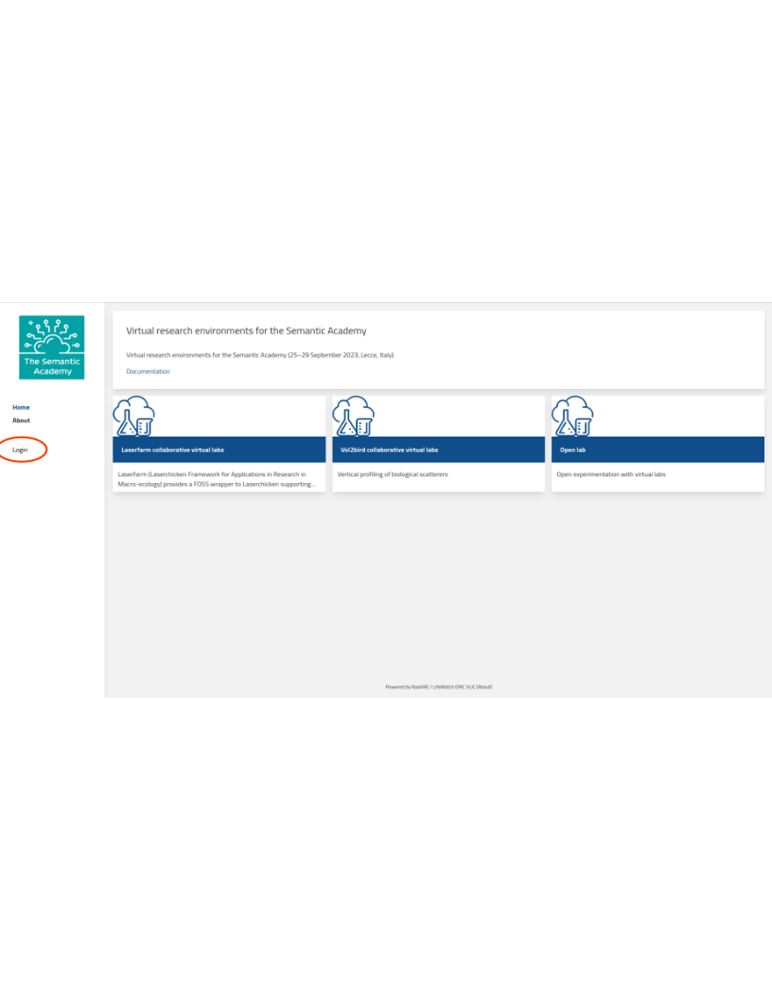
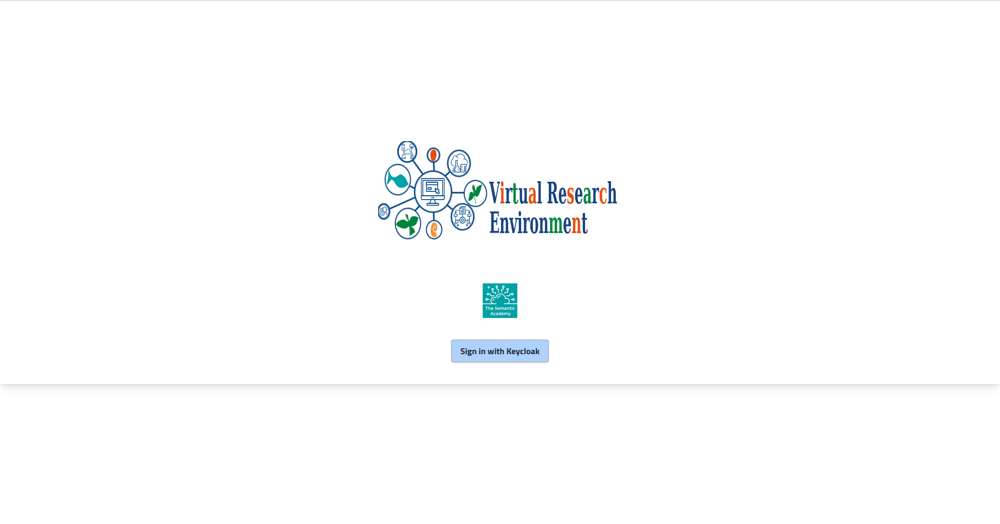
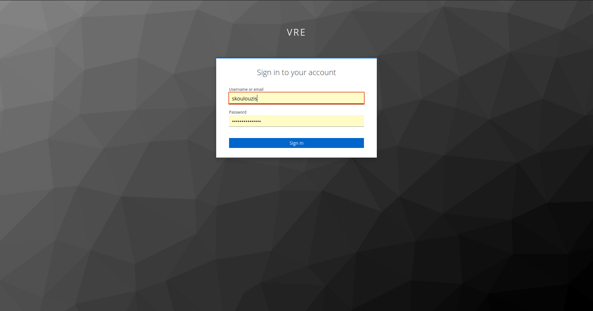
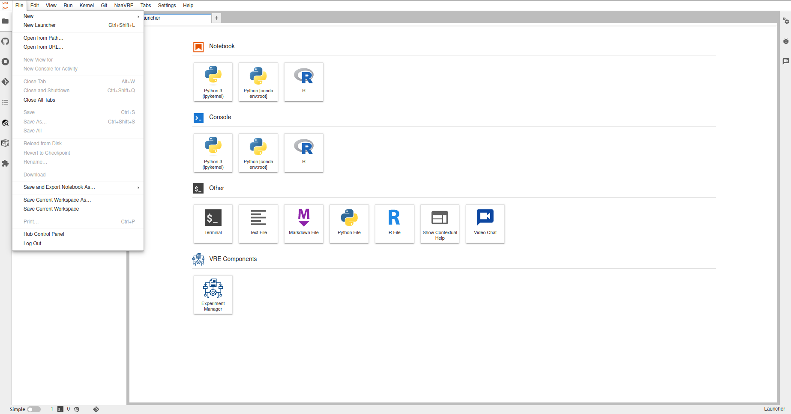
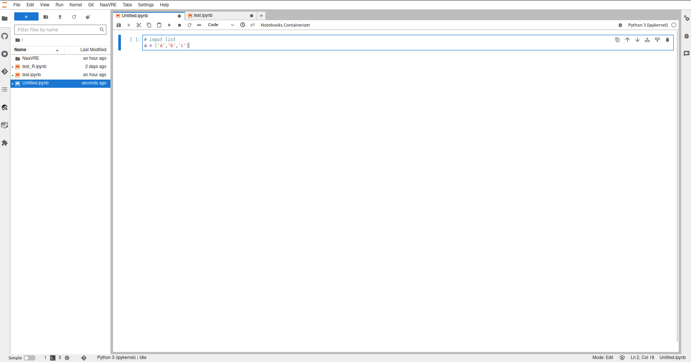
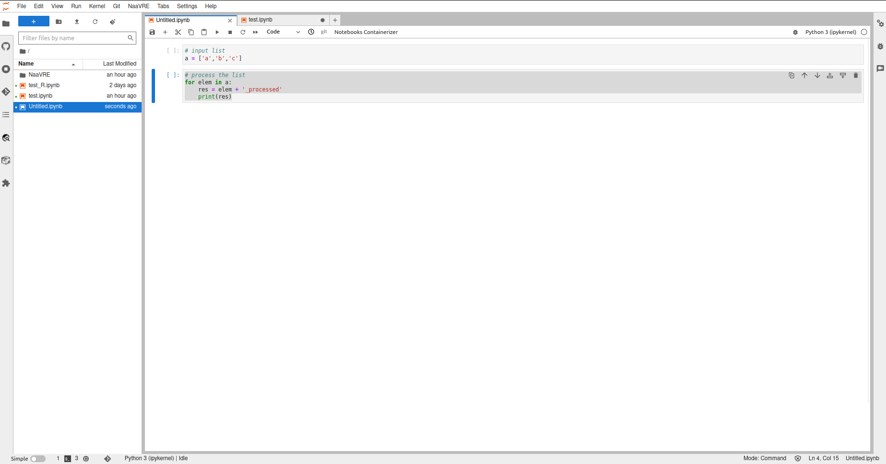
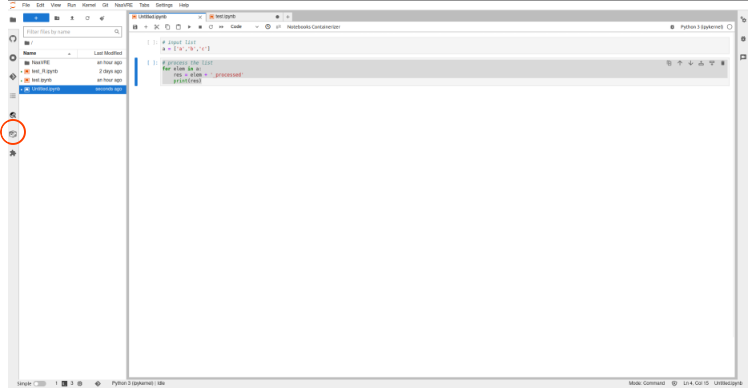
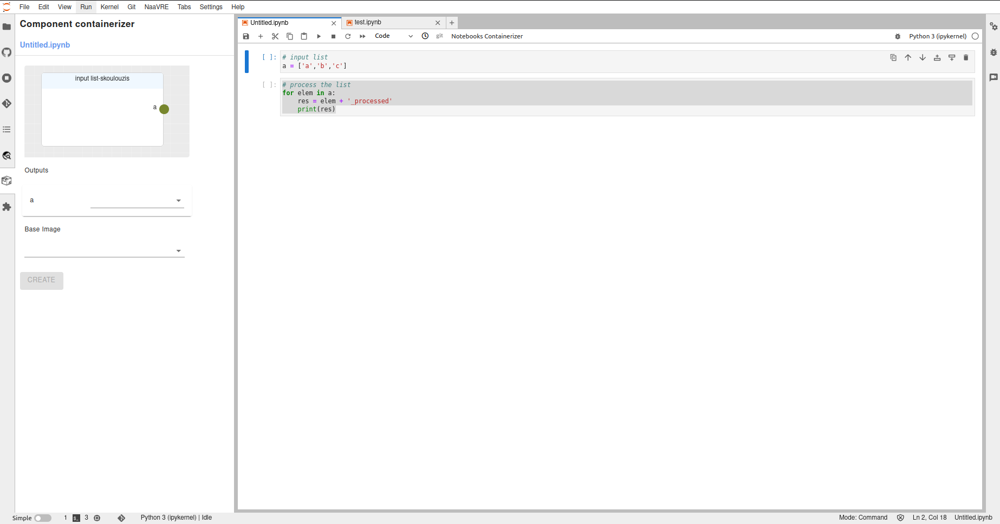
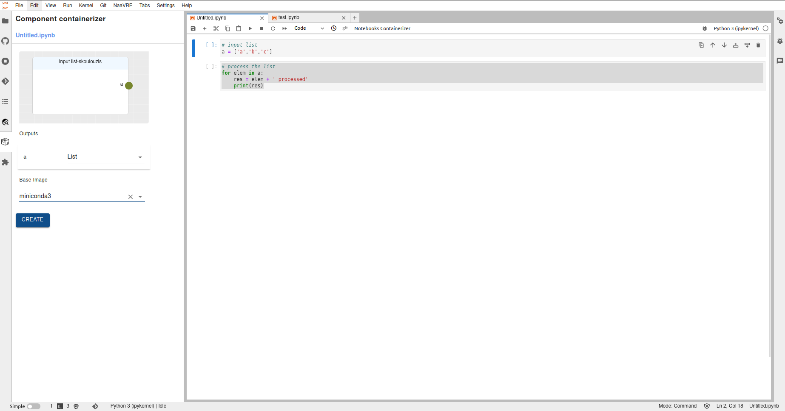
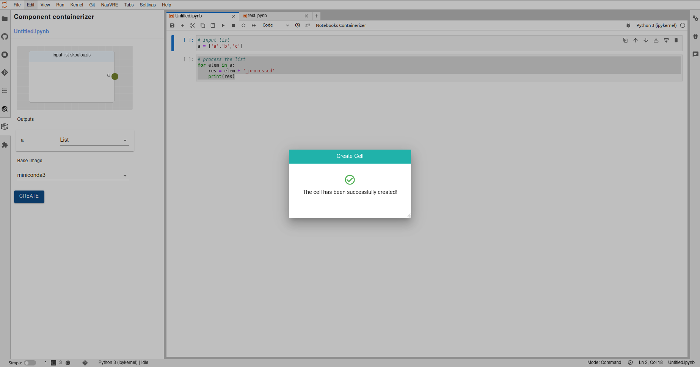

# Getting Started
This is a quick start guide to use basic functionality of the  LifeWatch VRE Platform as a Service (PaaSVRE) 
and Notebook as a Virtual Research Environment (NaaVRE).

## Platform as A Service VRE (PaaSVRE)
Navigate to the LifeWatch VRE Platform as a Service (VRE PaaS) and click on the 'Sign in' button.

Click on the 'Sign in with Keycloak' button.

Enter your credentials and click on the 'Sign in' button.

On the mai panel you will see several Virtual Labs (VLs). Select one of them. When in the VL you can see:
* A decryption of the VL
* The number instances currently running by other users 
* A lunch button to take you to your instance of Notebook as a Virtual Research Environment (NaaVRE)
* Assets that are available to you:
  * Workflow runs 
  * Data products
  * Geographical data products


To lunch your instance of NaaVRE click on the 'Lunch my instance' button. where you will be redirected to the 
NaaVRE.

## Notebook as a Virtual Research Environment (NaaVRE)
In the new page click on the 'Sign in' button. 

Next you will see the JupiterLab environment. If the Launcher page is not open it by clicking 'File->New->New Launcher'.


### Create a new Python Notebook

Click on the 'Python 3' icon to create a new Python Notebook and in the first cell type the following code:
```python
# input list
a = ['a','b','c']
```


Add a new cell and type the following code:
```python
# process the list
for elem in a:
    res = elem + '_processed'
    print(res)
```


### Containerize Cells 
To containerize the cells select the first cell and on the left column click on the 'LifeWatch Panel' button.

On the left panel you will see a preview of the containerized cell with any inputs, outputs and dependencies 

To containerize the cell select the type of the 'a' output as a 'List', the base image as miniconda3 and click on 
the 'Create' button.

If the containerization is successful you will see a pop-up message.



# Add Custom Module Names