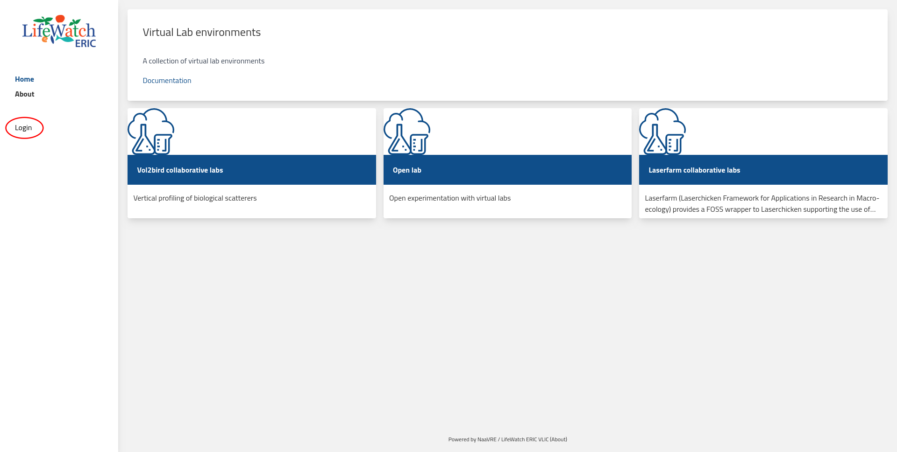
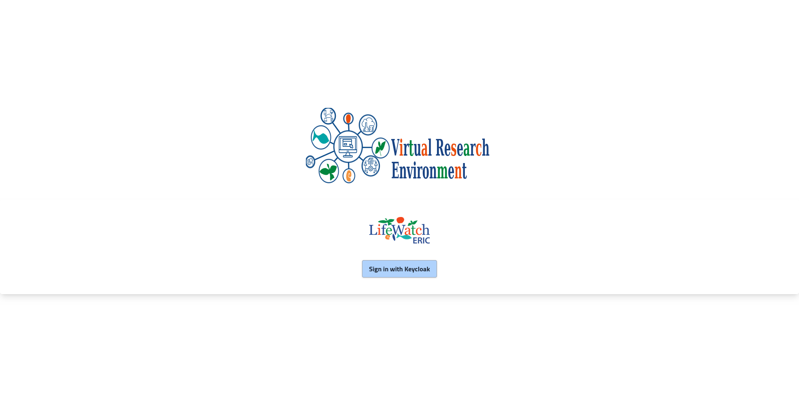
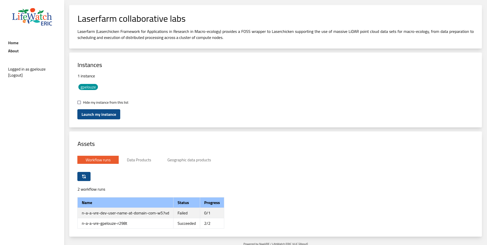

# Getting Started
This is a quick start guide to use basic functionality of the  LifeWatch VRE Platform as a Service (PaaSVRE) 
and Notebook as a Virtual Research Environment (NaaVRE).

## Platform as A Service VRE (PaaSVRE)
Navigate to the LifeWatch VRE Platform as a Service (VRE PaaS) and click on the 'Sign in' button.

Click on the 'Sign in with Keycloak' button.

Enter your credentials and click on the 'Sign in' button.

On the mai panel you will see several Virtual Labs (VLs). Select one of them. When in the VL you can see:
* A decryption of the VL
* The number instances currently running by other users 
* A lunch button to take you to your instance of Notebook as a Virtual Research Environment (NaaVRE)
* Assets that are available to you:
  * Workflow runs 
  * Data products
  * Geographical data products


To lunch your instance of NaaVRE click on the 'Lunch my instance' button. where you will be redirected to the 
NaaVRE.

## Notebook as a Virtual Research Environment (NaaVRE)
In the new page click on the 'Sign in' button. 

Next you will see the JupiterLab environment. If the Launcher page is not open it by clicking 'File->New->New Launcher'.


### Create a new Python Notebook

Click on the 'Python 3' icon to create a new Python Notebook and in the first cell type the following code:
```python
# input list
a = ['a','b','c']
```


Add a new cell and type the following code:
```python
# process the list
for elem in a:
    res = elem + '_processed'
    print(res)
```


### Containerize Cells 
To containerize the cells select the first cell and on the left column click on the 'LifeWatch Panel' button.

On the left panel you will see a preview of the containerized cell with any inputs, outputs and dependencies 

To containerize the cell select the type of the 'a' output as a 'List', the base image as miniconda3 and click on 
the 'Create' button.

If the containerization is successful you will see a pop-up message.


Repeat the same process for the second cell. 

If you get an error message like the one below, clear the 'Base Image' selection and re set it to 'miniconda3'.


### Compose a Workflow
To compose a workflow open a new Launcher page and click on the 'Experimenter Manager' icon.

On the Experiment Manager page on the bottom right click on the '+' button select the 'Cells Catalog'.

From the 'Cells Catalog' select the first cell you just containerized scroll down and click on the 'Add TO WORKSPACE' 
button.

Repeat the same process for the second cell.

Drag and drop the cell containing the name 'input list' to the composer on the main panel. Next drag and drop the 
special component called 'Splitter' from the Parallelization section and connect the 'input list' cell with the 
'Splitter'. Finally, drag and drop the cell containing the name 'process the list' to the composer and connect the 
'Splitter' with the 'process the list' cell. In the end the workflow should look like the one below.


---

 **NOTE**

 It is important to note that direction of the connections between the cells is important as it indicates the flow of ]
 data dependencies between the cells. Therefore, the flow should be: 'input list' -> 'Splitter' -> 'process the list'.

---

### Run the Workflow

To run the workflow you must first make sure that your cells have being containerized. This usually takes a few minutes.
You can check on the progress of the containerization by opening the 
[GitHub Actions page](https://github.com/QCDIS/NaaVRE-cells-summerschool-23/actions).

---

 **NOTE**

 The actions in the GitHub Actions page are triggered automatically when you containerize a cell. All cell from all users
 are containerized in the same GitHub Actions page. 

---

To execute the workflow click on the '+' button in the bottom right corner of the page and select the 'Execute Workflow' 
option.


Select the 'Execute' button. If the workflow submission is successful you will see a pop-up message. 

To check the progress of the workflow click on the link slight on the pop-up message. This will take you to the workflow
engine page.

From there you can sign in and check the progress of the workflow by selecting the 'If your organisation has configured 
single sign-on:' option

In the login page enter the same credentials you used to sign in to the VRE PaaS. If you are directed to an empty page
go back to the 'Experiment Manager' page and click on the link again. 

This time you should be able to see the progress of
the workflow execution.


# Add Custom Module Names